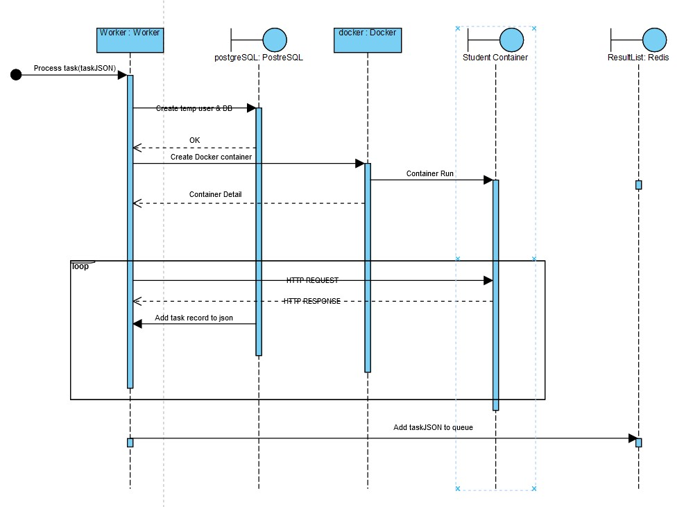

# Tester docs

## Component diagram

The entire project is shown in the component diagram below. The Tester package represents our application. We use
PostgreSQL for data storage, Redis for the queue, and Docker for containerization.

## Runner
Task in form of JSON is popped from Redis queue. Then runner/worker creates a Docker container for the student from 
the provided image and performs a series of pre-defined URL requests. The results are pushed back 
to Redis queue for processing.

